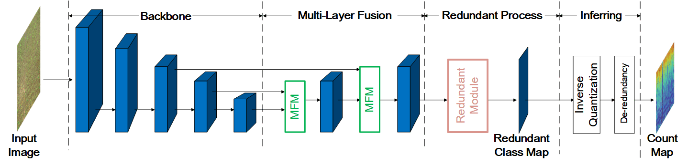
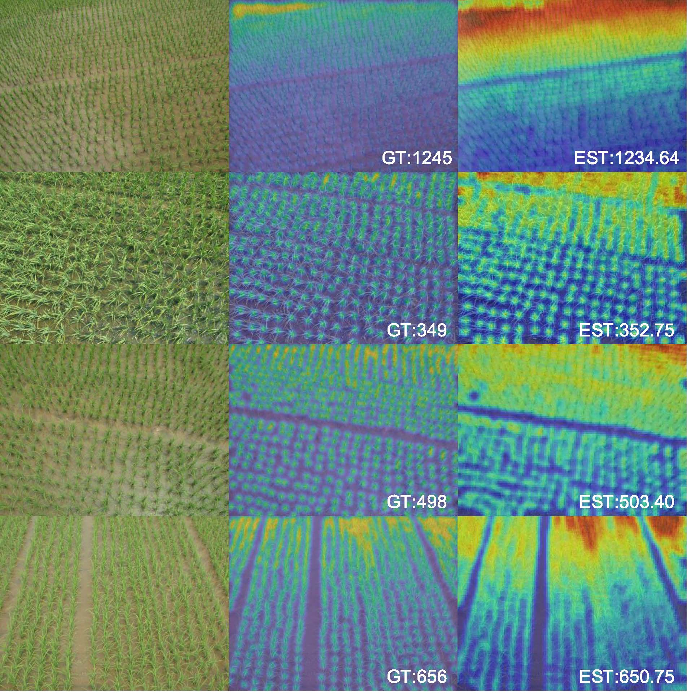

# SFC<sup>2</sup>Net
This repository implements SFC<sup>2</sup>Net proposed in the work:

**High-Throughput Rice Density Estimation from Transplantation to Tillering Stages Using Deep Networks**

Liang Liu, [Hao Lu](https://sites.google.com/site/poppinace/), Yanan Li, and Zhiguo Cao

Plant Phenomics, 2020

### Model Structure
<p align="left">
  
</p>

### Qualitative Results 
<p align="left">
  
</p>

## Installation
The code has been tested on Python 3.7.3 and PyTorch 1.3.1. Please follow the
official instructions to configure your environment. See other required packages
in `requirements.txt`.


## The RPC Dataset
* Download the Rice Plant Counting (RPC) test dataset from: [BaiduYun (597 
MB)](https://pan.baidu.com/s/12IDidkL267dpNSvNrcFRUQ) (code: cirv) or [OneDrive (597 
MB)](https://1drv.ms/u/s!AkNf_IPSDakh5zGoa6svOTC_Nmwr?e=nLkAlR)
* Unzip the dataset and move it into the `./data` folder, the path structure should look like this:
````
$./data/rice_datasets-test
├──── images
├──── label_mat
├──── test.txt
````

## Inference
**Pre-trained Model on RPC dataset**
* Download the model from: [BaiduYun (26.2 
MB)](https://pan.baidu.com/s/1HIFPbLJYCJy1ux1YO6bVsQ) (code: nhxk) or [OneDrive (26.2 
MB)](https://1drv.ms/u/s!AkNf_IPSDakh5zdqa5c8Co5QzB9y?e=EhqoWA)
* Move the model into the folder, and the path structure should be:
````
$./snapshots/rice/sfc2net
├──── model_best.pth.tar
````

**Evaluation**
```python
python hltest.py
```

## Benchmark Results

### Counting Results on the RPC Dataset
| Method              | Venue, Year           | Pretrained    | MAE    | MSE    | rMAE  | r<sup>2</sup> |
| :--:                | :--:                  | :--:          | :--:   | :--:   | :--:  | :--:          |
| MCNN                | CVPR   2016           | No            | 92.11  | 121.52 | 15.33 | 0.89          |
| TasselNetV2         | Plant Methods   2019  | No            | 59.39  | 95.80  | 7.86  | 0.91          |
| CSRNet              | CVPR   2018           | VGG16         | 49.22  | 74.58  | 7.47  | 0.91          |
| BCNet               | TCSVT  2019           | VGG16         | 31.28  | 49.82  | 4.76  | 0.96          |
| SFC<sup>2</sup>Net  | This Paper            | MixNet-L      | 25.51  | 38.06  | 3.82  | 0.98          |


### Comparison of Different Backbones
| Backbone            | MAE    | MSE    | rMAE | r<sup>2</sup> |    #Param.    | ImageNet Top-1 Acc.|
| :--:                | :--:   | :--:   | :--: |      :--:     |    :--:       | :--: |
| ResNet18            | 31.82  | 66.80  | 4.66 |      0.93     |    12.6M      | 69.8 |
| ResNet34            | 34.42  | 61.58  | 4.95 |      0.94     |    22.7M      | 73.3 |
| ResNet50            | 30.94  | 67.52  | 4.45 |      0.92     |    44.5M      | 76.2 |
| ResNet101           | 35.53  | 56.26  | 4.99 |      0.95     |    63.5M      | 77.4 |
| ResNet152           | 32.20  | 67.77  | 4.71 |      0.93     |    79.2M      | 78.3 |
| EfficientNet-B0     | 36.65  | 70.74  | 5.30 |      0.92     |    8.1M       | 77.3 |
| EfficientNet-B1     | 27.51  | 42.80  | 4.14 |      0.97     |    13.1M      | 79.2 |
| EfficientNet-B2     | 30.54  | 53.65  | 4.48 |      0.95     |    15.5M      | 80.3 |
| EfficientNet-B3     | 30.76  | 54.52  | 4.44 |      0.95     |    21.5M      | 81.7 |
| EfficientNet-B4     | 28.06  | 52.17  | 4.24 |      0.95     |    35.3M      | 83.0 |
| EfficientNet-B5     | 27.36  | 41.91  | 4.16 |      0.97     |    56.8M      | 83.7 |
| EfficientNet-B6     | 29.96  | 50.03  | 4.42 |      0.96     |    81.7M      | 84.2 |
| EfficientNet-B7     | 27.15  | 40.79  | 3.96 |      0.97     |    127.8M     | 84.4 |
| VGG16               | 30.67  | 57.53  | 4.51 |      0.95     |    15.7M      | 71.6 |
| MixNet-L            | 25.51  | 38.06  | 3.82 |      0.98     |    8.3M       | 78.9 |

## Citation
If you find this work or code useful for your research, please cite:
```
@article{liu2020high,
  title={High-Throughput Rice Density Estimation from Transplantation to Tillering Stages Using Deep Network},
  author={Liu, Liang and Lu, Hao and Li, Yanan and Cao, Zhiguo},
  journal={Plant Phenomics},
  year={2020}
}
```

## Permission
The code and data are only for non-commercial purposes. Copyrights reserved.

The training set of the RPC dataset is made available upon request. Contact: Hao Lu (poppinace@foxmail.com)
